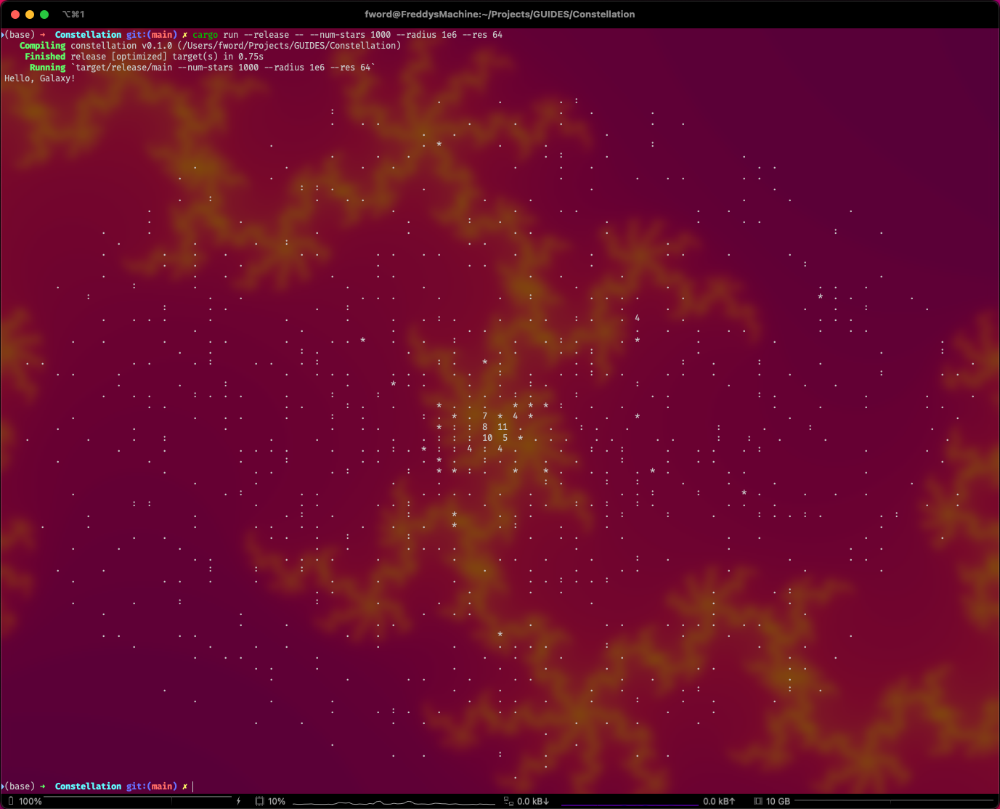

# Constellation

<div align="center">
    
</div>

N-body simulation.

## Quickstart

Clone the repository and change into the directory:

```shell
git clone https://github.com/FreddyWordingham/Constellation
cd Constellation
```

Create the `output/` directory:

```shell
mkdir output

```

Compile the code:

```shell
cargo run --release -- --radius 1e6 --res 512 --grav-strength 1.0e2 --smoothing-length 1e3 --num-stars 40000 --cmap 000000 000022 000077 AA00AA AA0000 FFFF00 FFFFFF
```

Render the simulation as an image:

<div align="center">
    
</div>

Or directly in the terminal:


